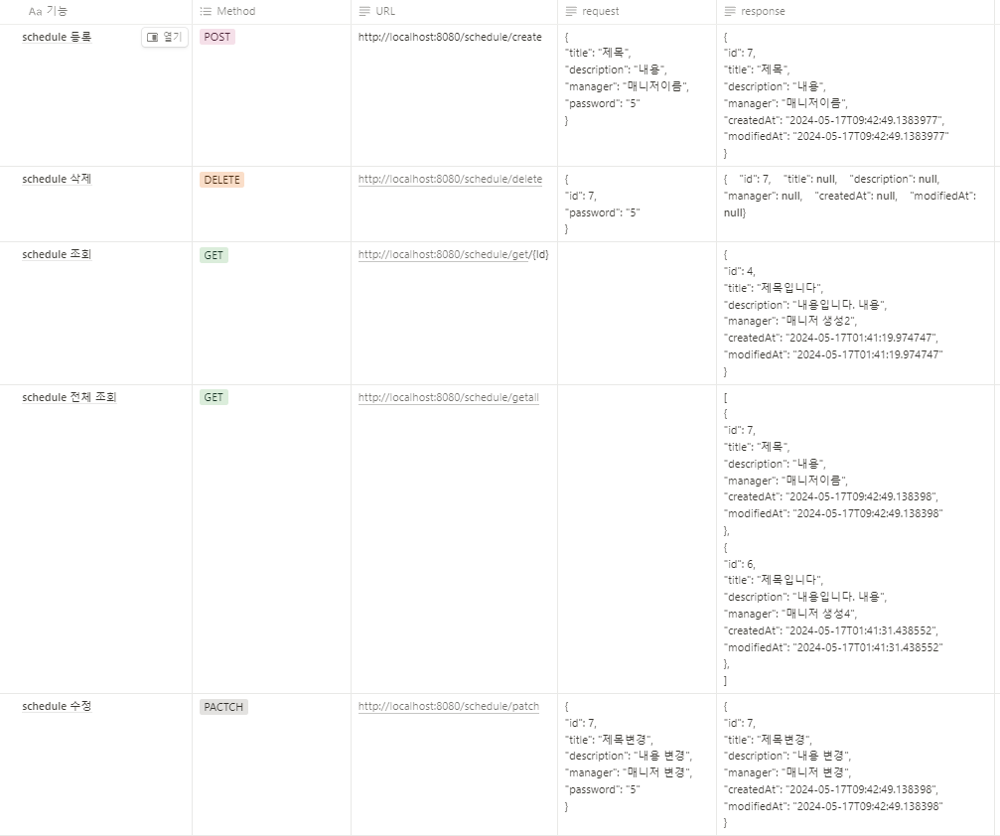

# create-schedule
## 목차
[1. 필수 요구 사항]( #1-필수-요구-사항 )

[2. Use Case Diagram]( #2-use-case-diagram )

[3. API 명세서]( #3-api-명세서 )

[3. ERD]( #4-erd)

# 입문 주차 
## 1. 필수 요구 사항
### 공통 조건
1. 일정 작성,수정,조회 시 반환 받은 일정 정보에 비밀번호는 제외 되어야 한다.
2. 일정 수정, 삭제 시 선택한 일정의 비밀번호와 요청할 때 함께 보낸 비밀번호가 일치할 경우에만 가능

#### 1단계 기능 : 일정 작성
* 할일 제목, 할일 내용, 담당자, 비밀번호, 작성일 을 저장 할 수 있다. 
  * 저장된 일정 정보를 반환 받아 확인할 수 있다.

#### 2단계 기능 : 선택한 일정 조회
* 선택한 일정의 정보를 조회할 수 있다.

#### 3단계 기능 : 일정 목록 조회
* 등록된 일정 전체를 조회 할 수 있다.
* 조회된 일정 목록은 작성일 기준 내림차순으로 정렬 되어있다.

#### 4단계 기능 : 선택한 일정 수정
* 선택한 일정의 할일 제목, 할일 내용, 담당자를 수정 할 수 있습다.
   * 서버에 일정 수정을 요청할 때 비밀번호를 함께 전달된다.
* 수정된 일정의 정보를 반환 받아 확인 할 수 있다.

#### 5단계 기능 : 선택한 일정 삭제
* 선택한 일정을 삭제 할 수 있다.
  * 서버에 일정 삭제를 요청할 때 비밀번호를 함께 전달한다.

### 추가 구현 기능

### 6단계 기능 : 예외 발생 처리
* 수정, 삭제 시 요청할 때 보내는 비밀번호가 일치하지 않을 때
* 선택한 일정 정보가 이미 삭제되어 조회할 수 없을 때
* 삭제하려는 일정 정보가 이미 삭제 상태일 때

### 7단계 기능 : Swagger 활용 & 파라미터 유효성 검사, null 체크 및 특정 패턴에 대한 검증 수행
* Swagger
    * wagger UI를 통해 API 목록을 확인할 수 있다.
    * Swagger UI를 통해 API 테스트를 할 수 있다.
* 유효성 검사
  * 할일 제목은 최대 200자 이내로 제한, 필수값 처리
  * 비밀번호는 필수값 처리
  * 담당자는 이메일 형식을 갖도록 처리
  
### 8단계 기능 : 파일 업로드 & 다운로드
* 사용자는 파일을 업로드 할 수 있습니다. 업로드된 파일은 개인 PC에 저장한다.
    * 특정 파일 형식만을 업로드할 수 있도록 구현할 수 있다.
    * JPG, PNG, JPEG 등 이미지

### 9단계 기능 : 테스트 코드 작성
* 주어진 요구사항에 따라 JUnit과 Mockito를 사용하여 테스트 코드를 작성
    * 이를 통해 각 기능이 의도한 대로 동작하는지 검증
* 코드 커버리지를 높이기 위해 Jacoco를 활용하여 테스트 코드가 대상 코드를 80% 이상 커버하도록 목표를 설정
* 소프트웨어의 품질을 높이고 안정성을 보장한다.
---
# 숙련 주차
## 1. 필수 요구 사항

#### 1단계 기능 : 일정과 댓글의 연관 관계
* 지난 과제에서 만든 일정에 댓글을 추가할 수 있습니다.
* ERD 에도 댓글 모델을 추가합니다.
* 각 일정에 댓글을 작성할 수 있도록 관련 클래스를 추가하고 연관 관계를 설정합니다.
* 매핑 관계를 설정합니다. (1:1 or N:1 or N:M)

#### 2단계 기능 : 댓글 등록
* 선택한 일정이 있다면 댓글을 등록합니다.
  * 댓글이 등록되었다면 client에게 반환합니다.
  * 선택한 일정이 DB에 저장되어 있어야 합니다.
  * 댓글을 식별하는 고유번호, 댓글 내용, 
  댓글을 작성한 사용자 아이디, 댓글이 작성된 일정 아이디, 작성일자를 저장할 수 있습니다.
* ⚠️예외 처리
  * 선택한 일정의 ID를 입력 받지 않은 경우
  * 댓글 내용이 비어 있는 경우
  * 일정이 DB에 저장되지 않은 경우

#### 3단계 기능 : 댓글 수정
* 선택한 일정의 댓글을 수정합니다.
  * 댓글이 수정되었다면 수정된 댓글을 반환합니다.
  * 댓글 내용만 수정 가능합니다. 
  * 선택한 일정과 댓글이 DB에 저장되어 있어야 합니다.
* ⚠️예외 처리
  * 선택한 일정의 ID를 입력 받지 않은 경우
  * 일정이나 댓글이 DB에 저장되지 않은 경우
  * 선택한 댓글의 사용자가 현재 사용자와 일치하지 않은 경우

#### 4단계 기능 : 댓글 삭제
* 선택한 일정의 댓글을 삭제합니다.
  * 성공했다는 메시지와 상태 코드 반환하기
  * 선택한 일정과 댓글이 DB에 저장되어 있어야 합니다.
* ⚠️예외 처리
  * 선택한 일정의 ID를 입력 받지 않은 경우
  * 일정이나 댓글이 DB에 저장되지 않은 경우
  * 선택한 댓글의 사용자가 현재 사용자와 일치하지 않은 경우

### 5 - 7 단계 공통 조건
1. 입문주차 개인 과제 일정 기능을 구현하면서 나온 예외처리를 Validation 어노테이션을 활용하여 수정합니다.
2. 2-4 단계에서 구현한 예외처리를 Validation 어노테이션을 활용하여 수정합니다.
3. 로그인을 구현 후 3, 4단계에서 구현한 기능에 아래 기능을 추가합니다.
  * 해당 사용자가 작성한 댓글만 삭제, 수정할 수 있습니다.

#### 5단계 기능 : 선택한 일정 삭제
* 선택한 일정을 삭제 할 수 있다.
  * 서버에 일정 삭제를 요청할 때 비밀번호를 함께 전달한다.

### 추가 구현 기능

### 6단계 기능: 예외 발생 처리
* 수정, 삭제 시 요청할 때 보내는 비밀번호가 일치하지 않을 때
* 선택한 일정 정보가 이미 삭제되어 조회할 수 없을 때
* 삭제하려는 일정 정보가 이미 삭제 상태일 때

### 7단계 기능: Swagger 활용 & 파라미터 유효성 검사, null 체크 및 특정 패턴에 대한 검증 수행
* Swagger
  * wagger UI를 통해 API 목록을 확인할 수 있다.
  * Swagger UI를 통해 API 테스트를 할 수 있다.
* 유효성 검사
  * 할일 제목은 최대 200자 이내로 제한, 필수값 처리
  * 비밀번호는 필수값 처리
  * 담당자는 이메일 형식을 갖도록 처리

### 8단계 기능: 파일 업로드 & 다운로드
* 사용자는 파일을 업로드 할 수 있습니다. 업로드된 파일은 개인 PC에 저장한다.
  * 특정 파일 형식만을 업로드할 수 있도록 구현할 수 있다.
  * JPG, PNG, JPEG 등 이미지

### 9단계 기능: 테스트 코드 작성
* 주어진 요구사항에 따라 JUnit과 Mockito를 사용하여 테스트 코드를 작성
  * 이를 통해 각 기능이 의도한 대로 동작하는지 검증
* 코드 커버리지를 높이기 위해 Jacoco를 활용하여 테스트 코드가 대상 코드를 80% 이상 커버하도록 목표를 설정
* 소프트웨어의 품질을 높이고 안정성을 보장한다.
---

## 2. Use Case Diagram

---

## 3. API 명세서

---

## 4. ERD

---

