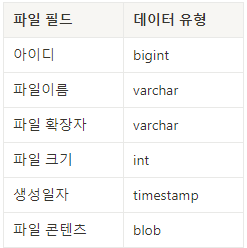
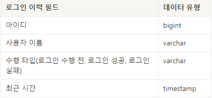
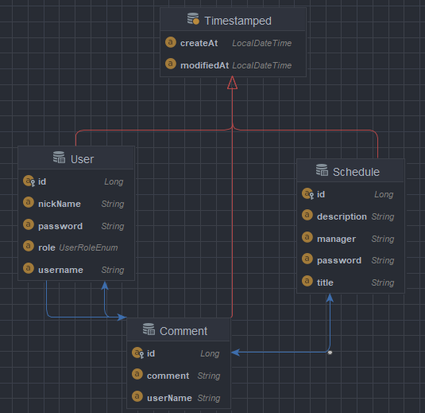

# create-schedule
## 목차
[1. 필수 요구 사항]( #1-필수-요구-사항 )

[2. Use Case Diagram]( #2-use-case-diagram )

[3. API 명세서]( #3-api-명세서 )

[3. ERD]( #4-erd)

# 입문 주차 
## 1. 필수 요구 사항
### 공통 조건
1. 일정 작성,수정,조회 시 반환 받은 일정 정보에 비밀번호는 제외 되어야 한다.
2. 일정 수정, 삭제 시 선택한 일정의 비밀번호와 요청할 때 함께 보낸 비밀번호가 일치할 경우에만 가능

#### 1단계 기능 : 일정 작성
* 할일 제목, 할일 내용, 담당자, 비밀번호, 작성일 을 저장 할 수 있다. 
  * 저장된 일정 정보를 반환 받아 확인할 수 있다.

#### 2단계 기능 : 선택한 일정 조회
* 선택한 일정의 정보를 조회할 수 있다.

#### 3단계 기능 : 일정 목록 조회
* 등록된 일정 전체를 조회 할 수 있다.
* 조회된 일정 목록은 작성일 기준 내림차순으로 정렬 되어있다.

#### 4단계 기능 : 선택한 일정 수정
* 선택한 일정의 할일 제목, 할일 내용, 담당자를 수정 할 수 있습다.
   * 서버에 일정 수정을 요청할 때 비밀번호를 함께 전달된다.
* 수정된 일정의 정보를 반환 받아 확인 할 수 있다.

#### 5단계 기능 : 선택한 일정 삭제
* 선택한 일정을 삭제 할 수 있다.
  * 서버에 일정 삭제를 요청할 때 비밀번호를 함께 전달한다.

## 추가 구현 기능

### 6단계 기능 : 예외 발생 처리
* 수정, 삭제 시 요청할 때 보내는 비밀번호가 일치하지 않을 때
* 선택한 일정 정보가 이미 삭제되어 조회할 수 없을 때
* 삭제하려는 일정 정보가 이미 삭제 상태일 때

### 7단계 기능 : Swagger 활용 & 파라미터 유효성 검사, null 체크 및 특정 패턴에 대한 검증 수행
* Swagger
    * wagger UI를 통해 API 목록을 확인할 수 있다.
    * Swagger UI를 통해 API 테스트를 할 수 있다.
* 유효성 검사
  * 할일 제목은 최대 200자 이내로 제한, 필수값 처리
  * 비밀번호는 필수값 처리
  * 담당자는 이메일 형식을 갖도록 처리
  
### 8단계 기능 : 파일 업로드 & 다운로드
* 사용자는 파일을 업로드 할 수 있습니다. 업로드된 파일은 개인 PC에 저장한다.
    * 특정 파일 형식만을 업로드할 수 있도록 구현할 수 있다.
    * JPG, PNG, JPEG 등 이미지

### 9단계 기능 : 테스트 코드 작성
* 주어진 요구사항에 따라 JUnit과 Mockito를 사용하여 테스트 코드를 작성
    * 이를 통해 각 기능이 의도한 대로 동작하는지 검증
* 코드 커버리지를 높이기 위해 Jacoco를 활용하여 테스트 코드가 대상 코드를 80% 이상 커버하도록 목표를 설정
* 소프트웨어의 품질을 높이고 안정성을 보장한다.

---
# 숙련 주차


#### 1단계 기능 : 일정과 댓글의 연관 관계
* 지난 과제에서 만든 일정에 댓글을 추가할 수 있습니다.
* ERD 에도 댓글 모델을 추가합니다.
* 각 일정에 댓글을 작성할 수 있도록 관련 클래스를 추가하고 연관 관계를 설정합니다.
* 매핑 관계를 설정합니다. (1:1 or N:1 or N:M)

#### 2단계 기능 : 댓글 등록
* 선택한 일정이 있다면 댓글을 등록합니다.
  * 댓글이 등록되었다면 client에게 반환합니다.
  * 선택한 일정이 DB에 저장되어 있어야 합니다.
  * 댓글을 식별하는 고유번호, 댓글 내용, 
  댓글을 작성한 사용자 아이디, 댓글이 작성된 일정 아이디, 작성일자를 저장할 수 있습니다.
### ⚠️ 예외 처리
  * 선택한 일정의 ID를 입력 받지 않은 경우
  * 댓글 내용이 비어 있는 경우
  * 일정이 DB에 저장되지 않은 경우

#### 3단계 기능 : 댓글 수정
* 선택한 일정의 댓글을 수정합니다.
  * 댓글이 수정되었다면 수정된 댓글을 반환합니다.
  * 댓글 내용만 수정 가능합니다. 
  * 선택한 일정과 댓글이 DB에 저장되어 있어야 합니다.
### ⚠️ 예외 처리
  * 선택한 일정의 ID를 입력 받지 않은 경우
  * 일정이나 댓글이 DB에 저장되지 않은 경우
  * 선택한 댓글의 사용자가 현재 사용자와 일치하지 않은 경우

#### 4단계 기능 : 댓글 삭제
* 선택한 일정의 댓글을 삭제합니다.
  * 성공했다는 메시지와 상태 코드 반환하기
  * 선택한 일정과 댓글이 DB에 저장되어 있어야 합니다.
### ⚠️ 예외 처리
  * 선택한 일정의 ID를 입력 받지 않은 경우
  * 일정이나 댓글이 DB에 저장되지 않은 경우
  * 선택한 댓글의 사용자가 현재 사용자와 일치하지 않은 경우

## 5 - 7 단계 공통 조건
1. 입문주차 개인 과제 일정 기능을 구현하면서 나온 예외처리를 Validation 어노테이션을 활용하여 수정합니다.
2. 2-4 단계에서 구현한 예외처리를 Validation 어노테이션을 활용하여 수정합니다.
3. 로그인을 구현 후 3, 4단계에서 구현한 기능에 아래 기능을 추가합니다.
  * 해당 사용자가 작성한 댓글만 삭제, 수정할 수 있습니다.

#### 5단계 기능 : JWT
* JWT를 이용한 인증/인가를 구현한다.
* 위 1~4 단계에서 인증/인가가 완료된 후에만 기능이 동작하도록 수정한다.
  * Access Token 만료시간 60분
  * Refresh Token 구현은 8단계이므로 이번에는 하지 않습니다.
### ⚠️ 예외 처리
  * 공통조건
    * StatusCode : 400
    * client에 반환
  * 토큰이 필요한 API 요청에서 토큰을 전달하지 않았거나 정상 토큰이 아닐 때
    * 에러 메세지 : 토큰이 유효하지 않습니다.
  * 토큰이 있고, 유효한 토큰이지만 해당 사용자가 작성한 게시글/댓글이 아닐 때
    * 에러 메세지 : 작성자만 삭제/수정할 수 있습니다.
  * DB에 이미 존재하는 username으로 회원가입을 요청할 때
    * 에러 메세지 : 중복된 username 입니다.
  * 로그인 시, 전달된 username과 password 중 맞지 않는 정보가 있을 때
    * 에러 메시지 : 회원을 찾을 수 없습니다.
  
#### 6단계 기능 : 회원가입
* 수정, 삭제 시 요청할 때 보내는 비밀번호가 일치하지 않을 때
* 선택한 일정 정보가 이미 삭제되어 조회할 수 없을 때
* 삭제하려는 일정 정보가 이미 삭제 상태일 때

#### 7단계 기능 : 로그인
* Swagger
  * wagger UI를 통해 API 목록을 확인할 수 있다.
  * Swagger UI를 통해 API 테스트를 할 수 있다.
* 유효성 검사
  * 할일 제목은 최대 200자 이내로 제한, 필수값 처리
  * 비밀번호는 필수값 처리
  * 담당자는 이메일 형식을 갖도록 처리

## 추가 구현 기능

#### 8단계 기능 : Refresh Token
* 5단계에서 구현한 JWT를 Refresh Token을 사용하도록 변경
* 세션 관리
  * 자주 로그인을 반복하지 않으면서 긴 유효 기간을 가진 Refresh Token을 통해 
사용자가 시스템에 지속적으로 연결되어 있을 수 있습니다.
* 리소스 관리
  * 서버가 세션 상태를 유지할 필요 없습니다. 클라이언트 측에서 JWT를 관리하기 때문에 서버는 
  세션을 위해 추가적인 자원을 사용하지 않아도 됩니다.

#### 9단계 기능 : 일정과 댓글 수정
* 로그인 한 사용자에 한하여 일정과 댓글을 작성하고 수정할 수 있는 기능
* 만료되지 않은 유효 토큰’인 경우에만 일정과 댓글 ‘생성’이 가능하도록 변경
* 조회는 누구나 할 수 있습니다!
* 보안
  * 사용자 인증을 통해 접근을 제어하여 보안을 강화합니다. 또한 개인 로그를 
  적재하고 분석하면 모니터링도 가능합니다.
* 사용자 경험
  * 로그인을 통해 개인을 식별하고 개인에 맞춘 서비스를 제공할 수 있습니다. 이를 통해 사용자 경험을 향상시킬 수 있습니다. 
  또한 사용자 추적을 통해 맞춤 서비스를 개발할 수 있습니다.
* 로그인을 하지 않으면 기능을 사용할 수 없다.
* 유효한 토큰인 경우에만 일정과 댓글을 작성할 수 있다.
* 일정을 생성한 사용자와 동일한 username이면 수정할 수 있다.
* 댓글을 작성한 사용자와 동일한 username이면 수정할 수 있다.

#### 10단계 기능: 파일 첨부 기능 with DB
- 파일 테이블 생성
- 일정에 파일을 첨부할 수 있는 기능
- 일정과 파일 테이블 간 연간관계 형성
  - 1:1 매핑
  - ERD에도 파일 모델을 추가합니다.
  

- 일정을 생성할 때 파일을 첨부할 수 있다.
- 일정을 수정할 때 파일을 첨부된 파일을 수정할 수 있다.
### ⚠️ 예외 처리

- 일정을 삭제할 때 파일도 함께 삭제된다.
- 파일 형식은 `png`, `jpg`만 가능하다.
- 용량은 최대 `5MB`까지만 가능하다.

#### 11단계 기능 : 로깅
### 기능

- 예외가 발생하면 로그 파일에 적재가 되고 해당 로그 파일을 기반으로 디버깅을 할 수 있다.


    | 로그 기록 항목 | 데이터 형식 (예시) |
    | --- | --- |
    | 시간 | 2024-05-14 15:37:21 |
    | 로그 레벨 | TRACE, DEBUG, INFO, WARN, ERROR (5개 중 1개) |
    | 스레드 명 | http-nio-8080-exec-10 |
    | 클래스 명 | com.example.myapp.service.SpartaService |
    | 로그 메세지 | User validation failed: userId=12345 reason=Email not verified |

### 예시 데이터

```xml
2024-05-14 15:37:21 ERROR [http-nio-8080-exec-10] com.example.myapp.service.SpartaService - User validation failed: userId=12345 reason=Email not verified
```

### 설명

- 문제 진단 및 해결
  - 로그를 참고해서 개발자는 서버의 상태를 모니터링하고 예상하지 못하는 문제가 발생했을 때 원인을 파악하여 해결할 수 있습니다.
- 성능 최적화
  - 로그를 참고해서 개발자는 서버에 작성해둔 로직의 성능을 분석하고 최적화 할 수 있습니다.
- 보안 강화
  - 서버에서 발생하는 모든 중요한 작업을 기록하여 비정상적인 접근이나 보안 위협을 초기에 발견하고 대응할 수 있습니다. 또한 사후에 보안 사고 원인을 규명하고 재발 방지에 도움을 줍니다.

### 조건
- 로그 레벨 ERROR 수준으로 `.log` 확장자로 추출

#### 12단계 기능 : 스프링 AOP
- 반복적이고 공통적인 작업을 분리하여 관리하기 위한 스프링 AOP를 사용해본다. 코드 중복을 줄이고 유지 보수를 편리하게 합니다. 이로인해 확장성 면에서 이점을 가질 수 있어 요구사항이 변경되더라도 효과적으로 처리할 수 있습니다. → 관심사의 분리

### 설명

- 로그인에 대한 모니터링을 하기 위해 로그인 과정 전반을 이력으로 남깁니다.

### 조건

- 스프링 AOP를 이용하여 로그인 이력을 데이터베이스에 저장합니다.
- 11단계에서 구현한 로그에도 기록이 되는지 확인합니다.
- ERD에도 로그인 이력 모델을 추가합니다.
- 로그인 이력 테이블 입력
  - 로그인 기능 수행 전 - Before
  - 로그인 기능 성공 - AfterReturning
  - 로그인 기능 실패 - AfterThrowing
  
  
  - 
  
---

## 2. Use Case Diagram

---

## 3. API 명세서

---


## 4. ERD

---


